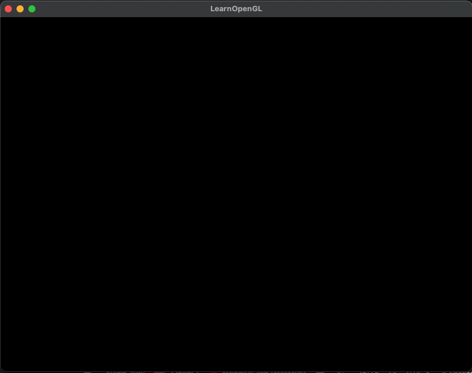

::github{repo="Hajiie/LearnOpenGL"}
[LearnOpenGL](https://learnopengl.com/) 강의 요약
2025-09-09 ~ Ing

# Getting Started
## OpenGL
- ~~그래픽, 이미지를 다루는데 사용할 수 있는 함수 집합을 제공하는 API~~
- Khronos Group이 개발, 유지 관리하는 기술 명세 혹은 규격

### OpenGL Specification
- 각 함수의 결과/출력이 무엇이고, 어떻게 동작하는지 명시
- OpenGL은 Specification(결과/출력/규격)을 준수하는 한 구현 방식 상이
- [OpenGL 3.3 명세서](https://www.opengl.org/registry/doc/glspec33.core.20100311.withchanges.pdf)

### Immediate Mode(Fixed Function Pipeline)
- 그래픽 처리 과정(파이프라인)의 각 단계가 정의돼있는 상태
- 실제 함수의 작동 방식(연산 방식) 습득엔 한계

### Core-profile
- Immediate Mode 의 기능을 뺀 순수한 OpenGL
- 정해진 기능이 아닌 사용자가 원하는 기능을 구현
- 3D 그래픽스 렌더링의 원리·컴퓨터 그래픽스에 대한 이해

### Extensions
- OpenGL은 하드웨어가 지원하는 한 새로운 최적화 방식, 기술 등을 적용 가능
- 하드웨어가 지원하지 않는다고 하여도 기존의 방식을 사용
- 확장된 기능이 유용한 경우 OpenGL 코어 기능으로 통합
```pseudo-code
if(GL_ARB_extension_name){
    // 하드웨어가 지원하는 새 방식
}
else{
    // 기존의 방식
}
```

### State Machine
오토마타 이론에 나오는 DFA 와 같은 기계는 `(상태, 입력) → 다음 상태`로의 전이가 정의된 모델
```Automata
(A state, 'a' input) → B state
```
OpenGL에서의 `State Machine`은 Design Pattern, OpenGL의 `상태`는 여러 설정 변수들의 집합
```OpenGL
glColor3f() → 일부만 변경
```

오토마타에서 State는 Machine이 있을 수 있는 State를 말하며,
`OpenGL Context` 는 OpenGL 이라는 Machine의 State를 말한다.   
`glUseProgram(shaderProgramID) 함수 호출로 사용할 셰이더 프로그램 Context를 변경`

오토마타처럼 Input이 들어가면 새로운 State를 출력한다는 개념이 아닌,
Input이 들어오면 현재 Context(State)를 변경하거나, 현재 Context(State)를 이용해서 다른 동작을 하는 개념
- Input → Change Context → `state-changing`
- Input → Use Context → `state-using`

### Objects
- OpenGL에서의 객체는 OpenGL Context의 하위 집합을 나타내는 상태 변수/설정의 집합
- C언어의 구조체처럼 객체는 데이터(설정값)의 컨테이너 역할

```pseudo-code
// create object
unsigned int objectId = 0;
glGenObject(1, &objectId); // objectId 를 새로 부여
// bind/assign object to context
glBindObject(GL_WINDOW_TARGET, objectId); // objectId 가 가리키는 객체에 bind
// set options of object currently bound to GL_WINDOW_TARGET
glSetObjectOption(GL_WINDOW_TARGET, GL_OPTION_WINDOW_WIDTH,  800); // objectId 가 가리키는 객체의 너비
glSetObjectOption(GL_WINDOW_TARGET, GL_OPTION_WINDOW_HEIGHT, 600); // 높이를 조정
// set context target back to default
glBindObject(GL_WINDOW_TARGET, 0); // unbind
```
- 원하는 설정값이 담긴 객체의 ID를 타겟에 바인딩하여 해당 타겟에 대한 후속 작업이 바인딩된 객체의 상태를 즉시 사용
  - A 라는 객체와 B 라는 객체에 서로 다른 설정이 있을 때, A 를 bind 하거나 B 를 bind 하는 식으로 다른 설정의 객체를 불러와 사용 가능

## Create Window

### GLFW 초기화 및 설정, winodw 객체 생성
GLFW 초기화 및 설정

`glfwWindowHint(구성하려는 옵션(GLFW_ 접두사가 붙은 열거형 옵션 중 택), 선택한 옵션의 값을 설정);`

```cpp
glfwInit(); // GLFW 초기화
glfwWindowHint(GLFW_CONTEXT_VERSION_MAJOR, 3); // GLFW 버전 설정 major
glfwWindowHint(GLFW_CONTEXT_VERSION_MINOR, 3); // GLFW 버전 설정 minor
glfwWindowHint(GLFW_OPENGL_PROFILE, GLFW_OPENGL_CORE_PROFILE); // GLFW 프로파일을 Core-profile 로 설정
glfwWindowHint(GLFW_OPENGL_FORWARD_COMPAT, GL_TRUE);
```

window 객체 생성
```cpp
// GLFW 윈도우 생성
GLFWwindow *window = glfwCreateWindow(800, 600, "LearnOpenGL", NULL, NULL);
if (window == NULL) { // 윈도우 생성 실패시
    std::cout<<"Failed to create GLFW window" << std::endl;
    glfwTerminate();
    return -1;
}
glfwMakeContextCurrent(window);
```

### GLAD
```cpp
// GLAD 초기화
if (!gladLoadGLLoader((GLADloadproc)glfwGetProcAddress)) {
    std::cout<<"Failed to initialize GLAD"<<std::endl;
    return -1;
}
```

### Viewport
`glViewport` 함수는 -1~1 사이의 값을 좌표계로 변환
(-0.5, 0.5) 는 우리가 설정한 좌표계에서 (200, 450) 으로 매핑
```cpp
glViewport(0, 0, 800, 600);
```

사용자가 창 크기를 변경하는 순간 Viewport도 함께 변경
창 크기가 변경될 때마다 호출되는 콜백 함수를 등록
```cpp
void framebuffer_size_callback(GLFWwindow *window, int width, int height); // prototype
```
`GLFWwindow`를 받고 새로운 창 크기의 너비, 높이를 인자로 받는 콜백 함수

생성한 콜백 함수를 GLFW에 등록
```cpp
glfwSetFramebufferSizeCallback(window, framebuffer_size_callback);
```
사용자 정의 함수를 등록하기 위해 설정할 수 있는 콜백 함수는 window 생성 후 render 루프 시작 전에 등록

### Render Loop
GLFW에 종료가 입력되기 전까지 계속 실행되는 렌더링 루프
```cpp
while (!glfwWindowShouldClose(window)) {
    glfwSwapBuffers(window);
    glfwPollEvents();
}
```
`glfwWindowShouldClose` 함수는 각 루프 반복 시작 시 GLFW에 종료가 입력됐는지 확인   
`glfwPollEvents` 함수는 이벤트(키보드 입력, 마우스 움직임 등)가 발생했는지 확인, 
window 상태를 업데이트 후 해당 이벤트 함수(콜백 메서드를 통해 등록 가능)를 호출   
`glfwSwapBuffers` 함수는 이번 렌더링 루프에서 렌더링에 사용된 버퍼를 교체   
:::note[Double Buffer]   
문제점
- 단일 버퍼에 어플리케이션이 렌더링 할 경우 이미지에 깜빡임이 발생

원인
- 출력 이미지가 순간적으로 그려지는 것이 아니라 순차적으로 픽셀 단위만큼 그려지기 때문

해결방안
- 프론트 버퍼는 현재 화면에 표시되는 최종 이미지를 출력   
- 백 버퍼는 다음에 표시될 이미지 렌더링을 수행   
- 백 버퍼의 렌더링이 모두 완료되면, 프론트 버퍼와 백 버퍼를 교체
:::

### Terminate & Result
```cpp
glfwTerminate();
return 0;
```
리소스를 정리하고 어플리케이션을 종료

실행 결과


### Input
GLFW 입력 제어 기능   
키를 입력으로 받는 `glfwGetKey` 함수 사용
```cpp
void processInput(GLFWwindow *window){
  if(glfwGetKey(window, GLFW_KET_ESCAPE) == GLFW_PRESS){
    glfwSetWindowShouldClose(window,true);
  }
}
```
ESCAPE 키가 입력 됐는지 확인, 입력되지 않았다면 `GLFW_RELEASE` 값을 반환   
ESCAPE 키를 누른 경우, `glfwSetwindowShouldClose` 함수를 사용하여 `WindowShouldClose` 속성을 true 로 설정   

### Rendering
모든 렌더링 커맨드를 렌더링 루프 내에 배치
```cpp
// render loop
while (!glfwWindowShouldClose(window)) {
    // input
    processInput(window);

    // rendering commands here
    ...

    // check and call events and swap the buffers
    glfwPollEvents();
    glfwSwapBuffers(window);
}
```
화면 내 색상 변경   
프레임 시작 시 이전 프레임의 결과가 나올 수 있기 때문에 `glClear` 함수를 사용해 화면의 색상 버퍼를 제거   
`glClear(지울 버퍼를 지정하기 위한 버퍼 비트 선택);`   

:::tip[설정 가능한 버퍼 비트]
- `GL_COLOR_BUFFER_BIT`
- `GL_GL_DEPTH_BUFFER_BIT`
- `GL_STENCIL_BUFFER_BIT`
:::

`glClearColor` 함수를 사용해 버퍼 색상 변경   
`glClearColor(R,G,B,A);`

:::note
`glClearColor` 함수는 state-changing(Change Context), 상태 설정 함수   
`glClear` 함수는 state-using(Use Context), 상태 사용 함수
:::

## Triangle
OpenGL은 3D, 스크린이나 Window는 2D 픽셀 배열  
OpenGL의 작업은 3D 좌표를 스크린(Window)에 맞는 2D 픽셀로 변환하는 것  
이 과정은 OpenGL의 `Graphics Pipeline`으로 관리  

>Graphics Pipeline
>- 3D 좌표계를 2D 좌표계로 변환하는 것
>- 2D 좌표계를 실제 색상 픽셀로 변환하는 것


Graphics Pipeline에 3D 좌표를 입력하면 해당 좌표는 2D 색상 픽셀로 변환  
Graphics Pipeline은 단계를 나눌 수 있고 각 단계의 입력은 전 단계의 출력을 받음   
각 단계는 하나의 고유한 기능을 수행하며, 병렬로 실행이 가능  
병렬처리 특성으로 현재의 그래픽 카드는 수천개의 프로세스 코어를 가짐  
프로세스 코어는 파이프라인의 각 단계마다 GPU 위에서 소규모 프로그램을 실행  
이러한 소규모 프로그램이 `Shaders`

Shaders 중 일부는 사용자가 직접 구성할 수 있어, 기존 Shaders를 구성한 shaders로 대체 가능  
Shaders의 이러한 특성으로 인해 파이프라인의 특정 부분까지 세밀한 제어가 가능  
GPU 위에서 실행되므 CPU 시간 또한 감소  
Shaders는 `OpenGL Shading Language`(GLSL)로 작성   


<div style="text-align: center;">Graphics Pipeline의 모든 단계</div>

3차원에서 삼각형을 형성해야하는 세 개의 좌표 목록을 `Vertex Data`라는 배열에 전달  
Vertex Data는 Vertex의 집합  
Vertex는 3D 좌표에 대한 데이터의 집합  
Vertex의 데이터는 `Vertex Attribute`로 표현, 어떤 형태의 데이터든 포함

:::note[Primitives(도형)]
OpenGL이 좌표와 색상을 처리하기 위해서 `Primitives`라는 Hint를 사용  
Primitives는 데이터를 점의 집합, 삼각형의 집합, 직선의 집을 나타내기 위함  
렌더링 명령을 호출 할 때 OpenGL에 전달   
- GL_POINTS
- GL_TRIANGLE
- GL_LINE_STRIP
:::

Pipeline의 구성

single vertex를 입력 받는 `Vertex Shader`  
Vertex Shader는 3D 좌표를 다른 3D 좌표로 변환, Vertex Attributes에 대해 기본적인 처리 수행  

Vertex Shader의 결과를 선택적으로 입력 받는 `Geometry Shader`  
Geometry Shader는 Primitive를 구성하는 vertex의 집합을 입력 받으며, 
새로운 vertex를 통해 새로운 primitive를 생성함으로써 다른 형상을 생성  
(위의 그림과 같이 3개의 vertex에서 네 번 째 vertex를 생성하여 두 개의 삼각형을 만듦)   

모든 vertex(GL_POINTS일 경우, 단일 vertex)를 입력으로 받는 `Primitive Assembly`(Shape Assembly)  
Primitive Assembly는 주어진 Primitive 형상 내의 모든 vertex를 구성  

Primitive Assembly의 결과를 입력 받는 `Resterization`  
Resterization은 Primitive Assembly의 결과를 화면의 Pixel에 매핑, 
Fragment Shader가 사용할 Fragment를 생성  

:::note[Clipping]
Fragment Shader가 실행되기 전에 `Clipping`이 수행
Clipping은 view(렌더링을 결정하는 공간) 밖에 있는 Fragment를 제거해서 성능을 향상시키는 역할
:::  
:::note[Fragment]
OpenGL에서 `Fragment`는 단일 pixel을 렌더링 하기 위해 필요한 모든 data
:::

Resterization에서 생성한 Fragment를 사용하는 `Fragment Shader`  
Fragment Shader는 픽셀의 최종 색상을 정하고, OpenGL의 고급 효과를 만드는 단계  
Fragment Shader에는 빛, 그림자, 빛의 색 등과 같은 픽셀의 최종 색상을 계산하기 위해 사용할 수 있는 3D Scene 데이터가 포함

해당하는 픽셀의 모든 색상이 결정된 최종 Fragment를 입력 받는 `Alpha Test & Blending`  
Alpha Test & Blending은 해당하는 Fragment의 깊이(및 Stencil)값을 확인하여, 
Fragment와 다른 객체 간의 순서를 판단하여 제거 여부 결정  
Alpha값(불투명도)를 확인하여 객체를 Blending  
:::note
Fragment Shader에서 픽셀의 최종 색상 값이 결정돼도, 실제 출력 색상은 바뀔 수 있음
:::

### Vertex Input
무언가 그리기 위해서 OpenGL에 처음으로 주는 데이터는 Vertex data  
OpenGL은 3D Graphics 라이브러리이므로, 지정하는 모든 좌표는 3D 좌표임(X, Y, Z)  
3D 좌표는 화면의 2D 픽셀값으로 쉽게 변환할 수 없음  
따라서 OpenGL은 3개의 축(X, Y, Z) 모두 특정 범위(-1.0 ~ 1.0) 사이의 3D 좌표만을 처리  
`Normalized Device Coordinates`(NDC)라고 불리는 범위 내의 모든 좌표는 화면에 표시되며, 이외의 다른 범위의 좌표는 표시되지 않음  

삼각형을 렌더링하기 위해서는 세 vertex가 필요로 하며, 세 vertex는 3D 좌표를 가짐
따라서 세 vertex는 OpenGL의 가시영역 내 NDC에서 float 배열로 정의할 필요가 있음  
```cpp
float vertices[] = {
    -0.5f, -0.5f, 0.0f,
     0.5f, -0.5f, 0.0f,
     0.0f,  0.5f, 0.0f,
};
```

삼각형이 가지는 각 vertex의 Z 좌표를 0.0으로 렌더링하면, 삼각형의 depth가 유지되어 2차원처럼 보일 수 있음  
:::note[Normalized Device Coordinates(NDC)]
Vertex Shader에서 Vertex 좌표가 처리되면, 해당 좌표는 NDC로 변환  
여기서 NDC는 X, Y, Z 값이 -1.0 ~ 1.0 사이의 작은 공간
범위 외의 좌표는 화면에 표시되지 않게 제거되거나 잘려짐
아래는 Z축이 무시된 채로 NDC 내의 삼각형

일반적인 화면 좌표계와 달리 Y축의 위쪽이 + 방향, 원점 (0,0) 좌표는 화면의 좌상단이 아닌 그래프의 중심에 위치  
변환된 모든 좌표가 좌표계(NDC)에 위치해야하며, NDC에 있지 않으면 표시되지 않음  
<u>glViewport</u> 데이터를 사용하여 viewport transform을 통해 screen-space coordinates로 변환
결과적으로 screen-space coordinates는 fragment로 변환되고, Fragment Shader의 입력값이 됨
:::  
Vertex Data가 정의되면 Graphics Pipeline의 첫 번째 프로세스인 Vertex Shader의 입력값으로 전달  
GPU에 정점 데이터를 저장할 메모리를 생성, OpenGL이 메모리를 해석하는 방식을 구성, VGA에 데이터를 전송하는 방법을 지정함으로써 이루어짐  
Vertex Shader는 메모리에서 설정한 vertex만큼 처리  

